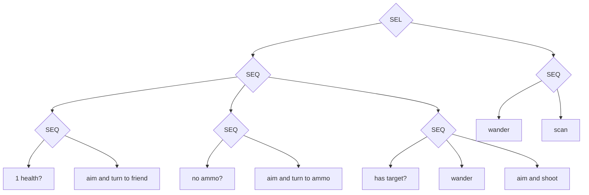

# Behavior tree

```mermaid
graph TD;

    Root{SEL}-->seq5{SEQ}

    seq5-->seq4{SEQ}
    seq4-->suicide[1 health?]
    seq4-->go_suicide[aim and turn to friend]

    seq5-->seq1{SEQ}
    seq1-->no_ammo[no ammo?]
    seq1-->get_ammo[aim and turn to ammo]

    seq5-->seq2{SEQ}
    seq2-->target[has target?]
    seq2-->target_wander[wander]
    seq2-->target_shoot[aim and shoot]

    Root{SEL}-->seq3{SEQ}
    seq3-->wander
    seq3-->scan
```